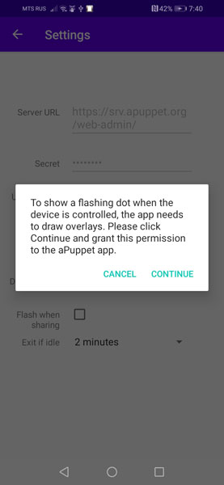
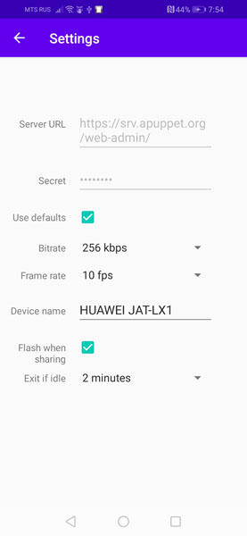

# aPuppet

## Описание

Система предоставляет возможность удалённого управления устройствами на базе Android из браузера. 

В состав системы входят:

- [Janus](https://janus.conf.meetecho.com/). Медиасервер
- [nginx](https://nginx.org/). Веб-сервер общего назначения
- [certbot](https://certbot.eff.org/). Агент для управления SSL-сертификатами, выпускаемыми [LetsEncrypt](https://letsencrypt.org/)
- web-admin. Веб-приложение администратора для удалённого управления устройствами

### Требования к системе

Для aPuppet желательно использовать отдельный сервер или облачный инстанс, чтобы полностью исключить какие-либо конфликты софта или портов.

Минимальные системные требования:

- 1 CPU
- 1 GB RAM
- 5 GB HDD

Другие требования:

- Архитектура `x84_64` / `amd64`
- ОС Ubuntu, возможные варианты:
    - Ubuntu Focal `20.04 LTS`
	- Ubuntu Bionic `18.04 LTS` 
	- Ubuntu Xenial `16.04 LTS`
- Командная оболочка `bash`

Полностью протестирована и подтверждена работоспособность на хостинге DigitalOcean на минимальной $5-инстансе со следующими версиями Ubuntu:

- Ubuntu Focal 20.04 LTS x64
- Ubuntu Bionic 18.04.3 LTS x64
- Ubuntu Xenial 16.04.6 LTS x64

Удалённое управление через web-admin полностью протестировано и работоспособно в следующих браузерах:
- Chrome 86+
- Firefox 83+
- Opera 72+

## Развёртывание

### Подготовка системы

Получим или обновим списки пакетов системы:

    sudo apt update

Установим git, если он ещё не установлен:

    sudo apt install -y git

### Установка aPuppet

#### Получение исходного кода

Систему необходимо загрузить на сервер посредством `git` из репозитория https://gitlab.com/headwind/remote-control.

Прежде всего, обратитесь к владельцу репозитория для получения доступа на скачивание системы.

Предварительно создайте SSH-ключ для доступа к репозиторию:

    ssh-keygen -t rsa -b 4096 -C "administrator@my-company.org"

Вместо `administrator@my-company.org` укажите свою почту, на все остальные запросы команды достаточно просто нажимать `Enter`

После успешной генерации ключа, выведите его на экран, скопируйте и отправьте владельцу репозитория, чтобы он добавил ваш ключ для доступа к скачиванию системы:

    cat ~/.ssh/id_rsa.pub

После того, как вам будет предоставлен доступ, можно склонировать систему:

    git pull git@gitlab.com:headwind/remote-control.git

Если при клонировании спросит про сертификат, необходимо ввести `yes`.

#### Перед установкой

Перейдём в папку с проектом:

    cd remote-control

Отредактируйте любым удобным способом файл `config.yaml`, указав название домена и электронную почту администратора: 

    ---
    hostname: "apuppet.my-company.org"
    email: "administrator@my-company.org"

_Важно: aPuppet создан для работы на выделенном доменном имени. Подходит как обычный домен вида `yourdomain.ru`, так и поддомен любого уровня. При установке система проверяет, что указанное в файле `config.yaml` доменное имя реально существует и указывает на ваш сервер, иначе установка прекращается. Поэтому перед запуском установки создайте и настройте отдельный домен или поддомен любого уровня так, чтобы DNS указывал на внешний IP адрес вышего сервера._

#### Установка

    sudo ./install.sh

После успешного выполнения данной команды aPuppet будет полностью сконфигурирован, установлен и запущен.

Теперь вы можете зайти в веб-приложение администратора (web-admin) по адресу `apuppet.my-company.org/web-admin/`

## Использование

Для управления устройством на него необходимо установить приложение [aPuppet](https://play.google.com/store/apps/details?id=com.hmdm.control) из Google Play.

При первом запуске необходимо дать приложению разрешения.
- на эмуляцию действий пользователя:

- отображать интерфейс поверх других приложений:

Изначально приложение настроено для использования на сервере aPuppet (src.apuppet.org). Адрес сервера, а также другие настройки можно изменить:

На основном экране приложения выводится статус подключения к серверу и реквизиты удалённого доступа `Session ID` и `Password`:

В web-admin необходимо ввести реквизиты доступа, после чего устройство запросит разрешение на получение содержимого экрана, и после подтверждения начнётся сессия удалённого управления:

## Обновления

В большинстве случаев для обновления aPuppet будет достаточно обновить исходники системы до актуальной версии и снова выполнить ./install.sh:

    cd remote-control
    git pull
    sudo ./install.sh

Практически всегда aPuppet будет успешно обновляться с помощью этого сценария.

В любых других нестандартных случаях, когда обновление потребует каких-либо иных действий от пользователя, об этом будет сообщено дополнительно и описано в документации.

## Подробности

### Установка

Скрипт install.sh:

- проверяет тип и версию ОС. При обнаружении запуска на любой другой ОС, кроме Ubuntu LTS версий 16.04, 18.04, 20.04 скрипт прерывает установку aPuppet
- устанавливает Ansible нужной версии
- запускает ansible-плейбук deploy/install.sh, который полностью устанавливает aPuppet и нужные зависимости
- запускает ansible-плейбук deploy/start.sh, который конфигурирует aPuppet и запускает его

Скрипт необходимо запускать с правами администратора, или через sudo:

    sudo ./install.sh

**При любых изменениях конфигурации aPuppet, правках в шаблонах или исходном коде web-admin всегда следует снова запускать скрипт install.sh для того, чтобы переконфигурировать aPuppet и запустить его с учётом всех изменений!**

#### Про Ansible

Для работы ansible-плейбуков требуется наличие Ansible версии 2.9.x.

Для Ubuntu Focal (20.04 LTS) в репозитории имеется нужная версия. Для Ubuntu Xenial (16.04 LTS) и Ubuntu Bionic (18.04 LTS) системный пакет не подходит (устарел), поэтому нужная версия пакета устанавливается из [официального PPA](https://launchpad.net/~ansible/+archive/ubuntu/ansible).

Подробнее об установке Ansible можно узнать из [официальной документации](https://docs.ansible.com/ansible/2.9/installation_guide/intro_installation.html).

_В будущем при установке Ansible из официального PPA может возникнуть ситуация, когда нужная нам версия 2.9.x заменится версией 2.10.x (или старше). В таком случае система развёртывания продукта работать не будет (в версии 2.10 произошли существенные изменения). Обратитесь к разработчику aPuppet, чтобы он предоставил актуальные на тот момент скрипты развёртывания продукта._ 

#### Устанавливаемое ПО 

Для обеспечения развёртывания и работы ansible-плейбуков устанавливается следующее ПО:

- Системные пакеты: `git`, `apt-transport-https`, `ca-certificates`, `curl`, `gnupg-agent`, `software-properties-common`, `python-pip`, `python3`, `python3-setuptools`, `python3-pip`
- Пакеты для Python 2: `dnspython`
- Пакеты для Python 3: `docker`, `docker-compose`, `dnspython` 

### Конфигурирование

Существует несколько файлов конфигурирования:

- `config.yaml`. Локальная конфигурация aPuppet. Все изменения по конфигурации вашей установки aPuppet необходимо производить здесь
- `deploy/config.build.yaml`. Конфигурация сборки и установки aPuppet. Здесь что-то изменять крайне не рекомендуется, так как это повлияет на саму сборку системы
- `deploy/config.defaults.yaml`. Конфигурация aPuppet по умолчанию

Список доступных параметров конфигурации, их значения по умолчанию и описания:
- `hostname`. Домен любого уровня, на котором будет работать aPuppet
- `email`. Электронная почта администратора. Пока используется при формировании сертификата как электронная почта администратора для получения важных уведомлений от [LetsEncrypt](https://letsencrypt.org/)
- для Janus:
    - `api_http: true`. Разрешен ли REST API по незащищённому протоколу HTTP. Рекомендуется оставить для работы с Nginx
    - `api_http_port: 8088`. Порт для REST API по HTTP 
    - `api_https: true`. Разрешён ли REST API по защищённому протоколу HTTPS
    - `api_https_port: 8089`. Порт для REST API по HTTPS
    - `admin_api_https: false`. Разрешён ли Admin REST API по протоколу HTTPS. Сейчас API для администрирования никак не используется, поэтому включать его не рекомендуется
    - `admin_api_https_port: 7889`. Порт для Admin REST API по HTTPS
    - `api_wss: true`. Разрешён ли - Websockets API по протоколу HTTPS (WSS). Рекомендуется оставить как наиболее эффективный способ взаимодействия сервера и web-admin
    - `api_wss_port: 8989`. Порт для Websockets API по HTTPS
- для Nginx
    - `is_nginx_enabled: true`. Включён ли nginx. Если выключен, для работы с web-admin необходимо разместить готовый к использованию web-admin (папка `deploy/dist/web-admin/`) на вашем веб-сервере
    - `web_http_port: 80`. Порт для HTTP
    - `web_https_port: 443`. Порт для HTTPS
- для RTP
    - `rtp_port_range: 10000-10500`. Диапазон портов UDP для RTP-трансляции видеопотока с устройств

- для SSL и Certbot
    - `is_certbot_enabled: true`. Включён ли Certbot. Если выключен, и не предоставлены данные вашего ssl-сертификата, все сервисы функционируют без защиты соединений.
    - `share_email: true`. Предоставлять ли вашу электронную почту [EFF](https://www.eff.org/) (Electronic Frontier Foundation) - организации-разработчику Certbot

### Варианты запуска и использования

Есть несколько вариантов установки aPuppet

#### Janus, Nginx, Certbot

Установка всех компонентов системы, формирование и регулярное обновление SSL-сертификата, необходимого для работы aPuppet.

Это вариант по умолчанию. В файле `config.yaml` не должно быть параметров `is_certbot_enabled` и `is_nginx_enabled`, либо они должны иметь значение `true`.

#### Janus, Nginx

Если у вас имеется свой сертификат, вы можете использовать его. Эта возможность доступна с использованием расширенной версии aPuppet, за подробностями обратитесь к разработчику.

Для реализации такого варианта нужно выключить certbot в файле `config.yaml`:

    is_certbot_enabled: false

#### Только Janus

Устанавливается только медиасервер. Вариант подходит, если у вас уже есть свой сертификат и развёрнутый сайт, куда вы хотите встроить веб-админку aPuppet.

Для реализации такого варианта нужно выключить certbot и nginx в файле `config.yaml`:

    is_certbot_enabled: false
    is_nginx_enabled: false

### Эксплуатация

Перед выполнением любых команд, необходимо перейти в папку с системой:

    cd ~/remote-control

Как упоминалось ранее, система построена на использовании `docker-compose`, поэтому для запуска, перезапуска, остановки системы (и любых других действий) используются команды docker-compose.

Просмотр запущенных сервисов и их состояния:

    docker-compose ps

Запуск сервисов (рекомендуемый и используемый способ):

    docker-compose up --detach

Также можно запустить в режиме foreground (в консоли, остановить систему можно будет комбинацией клавиш `Ctrl+C`). Для реального использования данный режим __НЕ рекомендуется__:

    docker-compose up

Перезапуск сервисов:

    docker-compose restart

Останов:

    docker-compose stop

Останов с удалением контейнеров, сетей, образов:

    docker-compose down

Подробнее о [командах docker-compose и их параметрах](https://docs.docker.com/compose/reference/overview/).

### Секреты

Для предотвращения несанкционированного доступа к Janus и использования его API при первоначальной установке формируется 2 секрета:

- `janus_api_secret`. Секрет для вызова обычных методов API. Включает латинские буквы и цифры, длина 8 символов.
Находится в файле `./dist/credentials/janus_api_secret`
- `janus_admin_api_secret`. Секрет для вызова методов Admin API. Включает латинские буквы и цифры, длина 15 символов.
Находится в файле `./dist/credentials/janus_admin_api_secret`

`janus_api_secret`, необходимый для работы как веб-приложения, так и мобильного приложения, автоматически прописывается в настройки веб-приложения, и выводится на экран при старте aPuppet.

### Логи

#### Настройка логов
Для ведения логов aPuppet используется стандартный механизм логов docker.

Параметры по умолчанию:
- драйвер: `json-file`
- компрессия: включена
- параметры ротации:
    - максимальный размер файла: 20 Mb
    - количество файлов: 5

Физически логи хранятся в системных папках docker'а, путь имеет вид `/var/lib/docker/containers/<container_id>/`.

Настройка параметров логов через ansible yaml-файлы конфигурации не предусмотрена, при необходимости это можно сделать напрямую в шаблоне docker-compose.yaml: `./dist/templates/docker-compose/docker-compose.yaml.j2`. Для каждого сервиса определена секция logging с параметрами логирования.

_Подробнее о [механизме логирования docker](https://docs.docker.com/config/containers/logging/configure/)_.

#### Просмотр логов

Для просмотра логов aPuppet можно использовать стандартные команды docker-compose.

Вывод всех имеющихся логов:

    docker-compose logs

Вывод всех логов по конкретному сервису или нескольким сервисам:

    docker-compose logs janus
    docker-compose logs nginx certbot

Для ограничения вывода последними N строками используется параметр `--tail`:

    docker-compose logs --tail=100

Для вывода поступающих сообщений в режиме реального времени используется параметр `--follow` или `-f`:
    
    docker-compose logs --tail=100 --follow

Параметры при необходимости гибко комбинируются:

    docker-compose logs --tail 100 --follow certbot
    docker-compose logs --tail=100 -f janus nginx

_Подробнее о просмотре логов в [docker](https://docs.docker.com/engine/reference/commandline/logs/) и [docker-compose](https://docs.docker.com/compose/reference/logs/)._

### web-admin

Это веб-приложение для удалённого управления устройствами администратором через браузер. Написано с применением HTML, CSS, JavaScript и различных библиотек.

Исходный код находится в папке `webadmin/`. При развёртывании производится сборка с помощью gulp: минификация и склеивание JS, CSS. Готовые к использованию файлы помещаются в папку `deploy/dist/web-admin`. Туда же релизится автоматически формируемый файл `settings.js` с необходимыми настройками aPuppet (пути, порты, секреты).

Любые правки нужно делать в папке с исходниками, после чего необходимо снова выполнить `./install.sh`.
